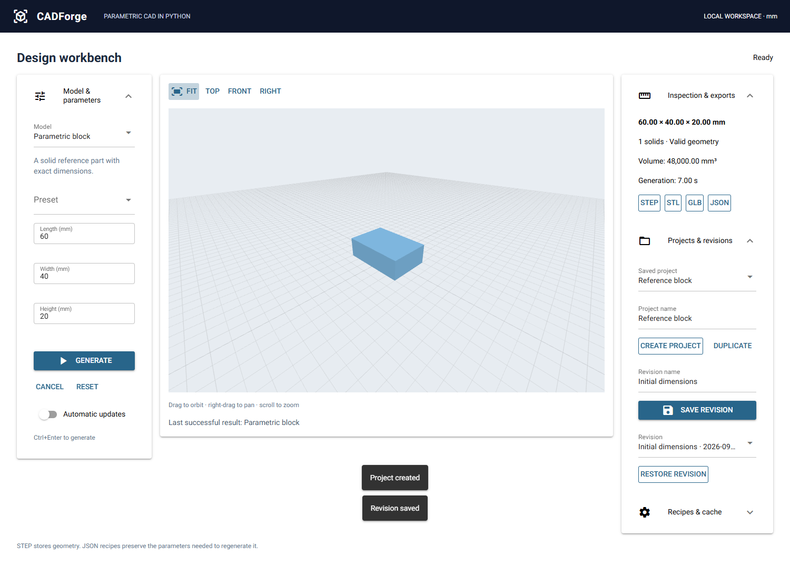

# CADForge — Parametric CAD in Python

A local CAD workbench built with **NiceGUI + build123d + SQLite + uv**. Choose a model, adjust dimensions, inspect a real OpenCascade solid, save a revision, and export.



## Run on Windows

Install [uv](https://docs.astral.sh/uv/getting-started/installation/), open PowerShell in this directory, then run:

```powershell
uv sync --locked
uv run cadforge
```

CADForge opens **http://127.0.0.1:8765**. It binds only to localhost. Close the terminal with Ctrl+C to stop it. If the port is unavailable:

```powershell
uv run cadforge --port 8766
```

Use `--no-browser` to start without opening a browser. Python **3.13.7** is recorded in `.python-version`; uv can install it if needed. The tested runtime is NiceGUI **3.17.0**, build123d **0.11.1**, and OpenCascade bindings **7.9.3.1.1**, with the full dependency graph in `uv.lock`. No Node build step or separate server is required. The first dependency installation downloads the native CAD kernel and scientific libraries and can take several minutes.

If your environment prevents writes to uv's normal cache directory, set `UV_CACHE_DIR` to a writable directory before running the commands.

## Implemented phases

| Phase                 | Delivered                                                                                                                                  |
| --------------------- | ------------------------------------------------------------------------------------------------------------------------------------------ |
| 1 — Foundation       | Installable Python package, NiceGUI app, separate CAD worker process, block, STEP and GLB                                                  |
| 2 — Geometry library | Six model generators, shared validation and presets, export capabilities based on result type                                              |
| 3 — Workspace        | Parameters, generation status, optional 700 ms automatic updates, cancellation, stale-result protection, camera controls, downloads        |
| 4 — Persistence      | SQLite projects, duplicate projects, deliberate revisions, restore, JSON recipes, version checks, separate persistent and cached artifacts |
| 5 — Verification     | Geometry/service tests, Python Playwright browser workflows, locked Windows installation, measured performance, documentation              |

This is a new implementation in an empty workspace. No legacy application was supplied or removed. There is no maintained React frontend, standalone FastAPI service, Jinja template application, CadQuery modeling package, or OpenSCAD integration. NiceGUI brings its own underlying web dependencies; `cadquery-ocp-*` packages supply OpenCascade bindings to build123d and do not install the CadQuery modeling library. OpenSCAD is outside this release; no legacy source was available here to preserve.

## Models and exports

| Model              | Details                                                             | Downloads                                              |
| ------------------ | ------------------------------------------------------------------- | ------------------------------------------------------ |
| Parametric block   | Length, width, height; cube preset                                  | STEP, STL, GLB, JSON                                   |
| NACA airfoil       | Validated four-digit code, chord, span; explicit solid/profile mode | Solids: STEP, STL, GLB, JSON; profiles: SVG, DXF, JSON |
| Simple car         | Body, cabin and four wheels as separate solids                      | STEP, STL, GLB, JSON                                   |
| Mounting bracket   | L-shaped part, one through hole in each leg                         | STEP, STL, GLB, JSON                                   |
| Hole-pattern plate | Centered row/column grid; overlap and boundary checks               | STEP, STL, GLB, JSON                                   |
| Enclosure          | Open box with separate flat lid displayed alongside                 | STEP, STL, GLB, JSON                                   |

The NACA profile uses 101 cosine-spaced samples per side, a closed trailing edge, and a polygonal CAD boundary. It is an approximation intended for configurable geometry, not an aerodynamics-certified profile or a smooth spline wing. Zero span is valid only in explicit profile mode. The car is an educational assembly, and the enclosure lid is a simple flat cover without fasteners or a fitted lip. Dimensions for assemblies include all displayed components, including the lid beside the box; assembly volume is the sum of component volumes.

STEP contains actual CAD geometry. STL and GLB are tessellated derivatives. Recipes retain the generator version and parameters; STEP does not retain CADForge's parametric history. Unsupported formats are absent from the current result's export controls.

## Workspace behavior

- Generate explicitly, use **Ctrl+Enter**, or enable **Automatic updates**.
- Orbit by dragging, pan with right-drag, and zoom with the wheel. **Fit**, **Top**, **Front**, and **Right** use NiceGUI's Python scene API. The camera remains in place when updating the same model; enable **Fit on update** for automatic framing. A **Loading preview** state now waits for browser mesh loading before the result becomes Ready. See [viewer design notes](VIEWER.md) for refresh behavior and the VTK assessment.
- Preview geometry is centered and placed above the grid for visibility; exported coordinates are unchanged.
- Side panels wrap on smaller screens and their sections can be collapsed.
- A previous successful result stays visible during generation or failure. Export buttons always refer to that displayed result. Saving a revision requires the current parameters to match the displayed result.
- Edits during a job mark its result outdated; it cannot replace the displayed geometry. Generating again cancels the previous job for that workspace.
- Create/select a project, name a checkpoint, and **Save revision**. Select a project and revision, then **Restore revision** to reopen it after a restart.
- **Duplicate** copies the selected project's latest saved revision. Import a JSON recipe under **Recipes & cache**, then Generate.

## Storage and generation

Persistent projects and revisions use the platform user-data directory (normally `%LOCALAPPDATA%\CADForge` on Windows). The separate cache uses `%LOCALAPPDATA%\CADForgeCache\Cache` on Windows, outside the persistent data directory.

Override paths with two separate, non-nested directories:

```powershell
$env:CADFORGE_DATA_DIR = 'D:\CADForgeData'
$env:CADFORGE_CACHE_DIR = 'D:\CADForgeCache'
uv run cadforge
```

SQLite stores projects and immutable revision recipes; each revision owns a copy of its completed artifacts. Cache clearing cannot delete saved revisions. The cache uses SHA-256 keys covering normalized recipes, generator versions, build123d/OpenCascade versions, and export settings. Identical queued requests reuse the first completed result. Each job writes to a private staging directory and publishes the completed directory by rename.

One worker runs at a time, with at most four admitted requests (running plus queued) across browser tabs. Generation times out after 120 seconds. Cancellation and timeouts kill and reap the worker. Idle completed cache entries are removed when older than 30 days or when needed to meet the 512 MiB limit; currently displayed results remain protected. **Clear unused cache** removes unprotected completed entries. Saved revision artifacts are retained without an automatic size limit. The application is intended to run as one instance per configured data/cache pair.

Preview deflection is 0.2 mm; STL export deflection is 0.05 mm. These are separate internal settings, not exposed controls. Cache retention is checked during generation and explicit cleanup, not by a background scheduler. A forced OS termination can leave a `job-*` staging directory; these cannot become successful results and can be removed manually while the application is stopped.

Process isolation keeps geometry work out of the UI event loop. It is not a sandbox, and the application accepts only its registered generators; there is no arbitrary code execution, cloud sharing, account system, or general CAD editor.

## Verification

From the project directory:

```powershell
uv run pytest tests/geometry tests/application -q
uv run ruff check src tests
```

For browser tests, start an isolated instance in one terminal:

```powershell
$env:CADFORGE_DATA_DIR = "$env:TEMP\cadforge-test-data"
$env:CADFORGE_CACHE_DIR = "$env:TEMP\cadforge-test-cache"
uv run cadforge --no-browser --port 8766
```

Then, in another terminal:

```powershell
$env:CADFORGE_TEST_URL = 'http://127.0.0.1:8766'
uv run pytest tests/browser -q
```

Browser tests use installed Chrome; set `CADFORGE_BROWSER_CHANNEL=msedge` to use Edge. Without `CADFORGE_TEST_URL`, browser tests skip deliberately. Tests create projects only in the instance they target; use the isolated paths above.

Coverage includes reference dimensions and volumes, six STEP round-trips, all presets, invalid inputs, 2D exports, recipe compatibility, cache reuse, duplicate requests, timeout and cancellation recovery, queue admission, saving/reopening/duplicating projects, cache clearing without revision loss, browser preview loading and STEP downloads, recipe import, restoration after reload, stale results, automatic updates, and small-screen controls.

**Verified:** 41 geometry/application cases and 12 browser workflows passed; Ruff and `uv sync --locked` passed. See `PHASES.md` for the phase evidence.

`preview-timing.json` records a successful local GLB request (about 9.7 ms), excluding geometry generation and GPU rendering.

`benchmark.json` records a Windows measurement run, including cold worker startup, cache hits, sampled worker RSS, and parent memory change over ten updates. Run your own measurement with:

```powershell
uv run python tests/benchmark.py "$env:TEMP\cadforge-benchmark" benchmark.json
```

Use an empty benchmark directory to measure uncached generation. Results depend on the machine and filesystem cache. This is a short diagnostic, not a long-duration memory-leak test. Windows/Python 3.13.7/Chrome have been exercised; other platforms are not claimed as verified.

## Source layout and extension

- `src/cadforge/app.py`: CLI and local server lifecycle.
- `models/`: parameter definitions, registry, and six independent geometry generators.
- `services/`: subprocess jobs, exports, cache, recipes, and project operations.
- `storage/`: SQLite schema version checking and initialization.
- `ui/`: Python-authored workspace and viewer.
- `tests/`: geometry, service, browser tests, and a repeatable benchmark.

To add a model, define its metadata and parameter rules in the registry, add its Python generator, and provide geometry/export tests. Increment its generator version when its geometric behavior changes. Unsupported stored generator versions are rejected rather than silently migrated.

Edge overlays, advanced selection, general modeling, arbitrary source execution, parameter studies, drawings, assembly constraints, and user-facing tessellation controls remain future work. Name, domain, package-name, and trademark availability have not been checked.

References: [build123d export APIs](https://build123d.readthedocs.io/en/stable/import_export.html), [NiceGUI scene](https://nicegui.io/documentation/scene).
